Classification Study - Car Quality Analysis
===========================================

Importing Libraries
-------------------

    library(dplyr)

    ## 
    ## Attaching package: 'dplyr'

    ## The following objects are masked from 'package:stats':
    ## 
    ##     filter, lag

    ## The following objects are masked from 'package:base':
    ## 
    ##     intersect, setdiff, setequal, union

    library(ggplot2)
    library(rattle)

    ## Rattle: A free graphical interface for data science with R.
    ## Version 5.2.0 Copyright (c) 2006-2018 Togaware Pty Ltd.
    ## Type 'rattle()' to shake, rattle, and roll your data.

    library(caret)

    ## Loading required package: lattice

    library(maptree)

    ## Warning: package 'maptree' was built under R version 3.5.2

    ## Loading required package: cluster

    ## Loading required package: rpart

    library(randomForest)

    ## randomForest 4.6-14

    ## Type rfNews() to see new features/changes/bug fixes.

    ## 
    ## Attaching package: 'randomForest'

    ## The following object is masked from 'package:rattle':
    ## 
    ##     importance

    ## The following object is masked from 'package:ggplot2':
    ## 
    ##     margin

    ## The following object is masked from 'package:dplyr':
    ## 
    ##     combine

Setting Seed for replication of results
---------------------------------------

    set.seed(2806)

Importing Data
--------------

    car <- read.csv("C:/Users/Fahim Usman/Documents/Edu/Data Science/R/data/car_evaluation.csv", 
                    col.names = c("buying", "maint", "doors", "persons", "lugboot", "safety", "CAR"),
                    colClasses = c(rep("factor",7)))

Data Overview
-------------

    head(car)

    ##   buying maint doors persons lugboot safety   CAR
    ## 1  vhigh vhigh     2       2   small    med unacc
    ## 2  vhigh vhigh     2       2   small   high unacc
    ## 3  vhigh vhigh     2       2     med    low unacc
    ## 4  vhigh vhigh     2       2     med    med unacc
    ## 5  vhigh vhigh     2       2     med   high unacc
    ## 6  vhigh vhigh     2       2     big    low unacc

    summary(car)

    ##    buying      maint       doors     persons     lugboot     safety   
    ##  high :432   high :432   2    :431   2   :575   big  :576   high:576  
    ##  low  :432   low  :432   3    :432   4   :576   med  :576   low :575  
    ##  med  :432   med  :432   4    :432   more:576   small:575   med :576  
    ##  vhigh:431   vhigh:431   5more:432                                    
    ##     CAR      
    ##  acc  : 384  
    ##  good :  69  
    ##  unacc:1209  
    ##  vgood:  65

    str(car)

    ## 'data.frame':    1727 obs. of  7 variables:
    ##  $ buying : Factor w/ 4 levels "high","low","med",..: 4 4 4 4 4 4 4 4 4 4 ...
    ##  $ maint  : Factor w/ 4 levels "high","low","med",..: 4 4 4 4 4 4 4 4 4 4 ...
    ##  $ doors  : Factor w/ 4 levels "2","3","4","5more": 1 1 1 1 1 1 1 1 1 1 ...
    ##  $ persons: Factor w/ 3 levels "2","4","more": 1 1 1 1 1 1 1 1 2 2 ...
    ##  $ lugboot: Factor w/ 3 levels "big","med","small": 3 3 2 2 2 1 1 1 3 3 ...
    ##  $ safety : Factor w/ 3 levels "high","low","med": 3 1 2 3 1 2 3 1 2 3 ...
    ##  $ CAR    : Factor w/ 4 levels "acc","good","unacc",..: 3 3 3 3 3 3 3 3 3 3 ...

Attribute Information (variables in all small letters)
------------------------------------------------------

<table>
<thead>
<tr class="header">
<th>Variable</th>
<th>Info</th>
</tr>
</thead>
<tbody>
<tr class="odd">
<td>CAR</td>
<td>car acceptability</td>
</tr>
<tr class="even">
<td>. PRICE</td>
<td>overall price</td>
</tr>
<tr class="odd">
<td>. . buying</td>
<td>buying price</td>
</tr>
<tr class="even">
<td>. . maint</td>
<td>price of the maintenance</td>
</tr>
<tr class="odd">
<td>. TECH</td>
<td>technical characteristics</td>
</tr>
<tr class="even">
<td>. . COMFORT</td>
<td>comfort</td>
</tr>
<tr class="odd">
<td>. . . doors</td>
<td>number of doors</td>
</tr>
<tr class="even">
<td>. . . persons</td>
<td>capacity in terms of persons to carry</td>
</tr>
<tr class="odd">
<td>. . . lug_boot</td>
<td>the size of luggage boot</td>
</tr>
<tr class="even">
<td>. . safety</td>
<td>estimated safety of the car</td>
</tr>
</tbody>
</table>

Verifying the order of levels of all variables
----------------------------------------------

Attribute Levels

<table>
<thead>
<tr class="header">
<th>Attributes</th>
<th>Values</th>
</tr>
</thead>
<tbody>
<tr class="odd">
<td>buying</td>
<td>v-high, high, med, low</td>
</tr>
<tr class="even">
<td>maint</td>
<td>v-high, high, med, low</td>
</tr>
<tr class="odd">
<td>doors</td>
<td>2, 3, 4, 5-more</td>
</tr>
<tr class="even">
<td>persons</td>
<td>2, 4, more</td>
</tr>
<tr class="odd">
<td>lug_boot</td>
<td>small, med, big</td>
</tr>
<tr class="even">
<td>safety</td>
<td>low, med, high</td>
</tr>
</tbody>
</table>

Fixing Attribute Levels

    levels(car$buying) # needs correction

    ## [1] "high"  "low"   "med"   "vhigh"

    car$buying <- factor(car$buying, levels = c("vhigh", "high", "med", "low"))

    levels(car$maint) # needs correction

    ## [1] "high"  "low"   "med"   "vhigh"

    car$maint <- factor(car$maint, levels = c("vhigh", "high", "med", "low"))

    levels(car$doors) # fine as is

    ## [1] "2"     "3"     "4"     "5more"

    levels(car$persons) # fine as is

    ## [1] "2"    "4"    "more"

    levels(car$lugboot) # needs correction

    ## [1] "big"   "med"   "small"

    car$lugboot <- factor(car$lugboot, levels = c("small", "med", "big"))

    levels(car$safety) # needs correction

    ## [1] "high" "low"  "med"

    car$safety <- factor(car$safety, levels = c("low", "med", "high"))

    levels(car$CAR) # needs correction

    ## [1] "acc"   "good"  "unacc" "vgood"

    car$CAR <- factor(car$CAR, levels = c("unacc", "acc", "good", "vgood"))

Verifying that all levels are in order

    summary(car)

    ##    buying      maint       doors     persons     lugboot     safety   
    ##  vhigh:431   vhigh:431   2    :431   2   :575   small:575   low :575  
    ##  high :432   high :432   3    :432   4   :576   med  :576   med :576  
    ##  med  :432   med  :432   4    :432   more:576   big  :576   high:576  
    ##  low  :432   low  :432   5more:432                                    
    ##     CAR      
    ##  unacc:1209  
    ##  acc  : 384  
    ##  good :  69  
    ##  vgood:  65

EDA
---

### Data distribution

    lapply(car[, -7], table)

    ## $buying
    ## 
    ## vhigh  high   med   low 
    ##   431   432   432   432 
    ## 
    ## $maint
    ## 
    ## vhigh  high   med   low 
    ##   431   432   432   432 
    ## 
    ## $doors
    ## 
    ##     2     3     4 5more 
    ##   431   432   432   432 
    ## 
    ## $persons
    ## 
    ##    2    4 more 
    ##  575  576  576 
    ## 
    ## $lugboot
    ## 
    ## small   med   big 
    ##   575   576   576 
    ## 
    ## $safety
    ## 
    ##  low  med high 
    ##  575  576  576

As can be seen from the tables for each variable, they are all evenly
distributed.

Let's now see how the output (predicted) variable is distributed

    plot(car$CAR, main = "Distribution of Car Quality variable 'CAR'", xlab = "Car Quality", ylab = "Count")

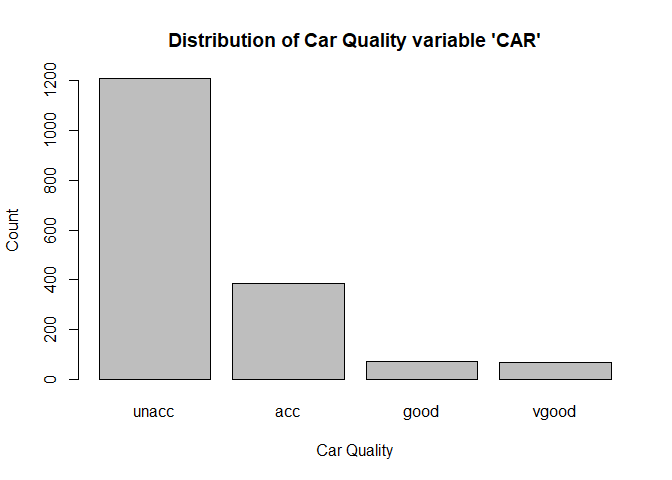

    prop.table(table(car$CAR))

    ## 
    ##      unacc        acc       good      vgood 
    ## 0.70005790 0.22235090 0.03995368 0.03763752

-   The data is dominated by "unacceptable" which assumes 70% of the
    predictor's distribution  
-   "acceptable" takes the remaining 22% of the predictor's
    distribution  
-   The output variable has uneven distribution with only a combined 8%
    being either "good" or "very good"

### Data Visualization

We will first see how each variable affects our prediction i.e. CAR.

#### Creating a Theme variable for ggplots

We will use a theme variable which will contain all the theme settings
for ggplots to append to ggplot statements so as to prevent repetition.

    gg_theme <- theme(plot.title = element_text(size = 12, face = "bold", hjust = 0.5),
                      axis.title = element_text(size = 10),
                      axis.text = element_text(size = 8),
                      axis.text.x = element_blank(),
                      axis.ticks.x = element_blank())

#### Plots

We will hide the repetitive ggplot2 code (using echo = FALSE) to
declutter our markdown and just have a quick glance on all the plots -

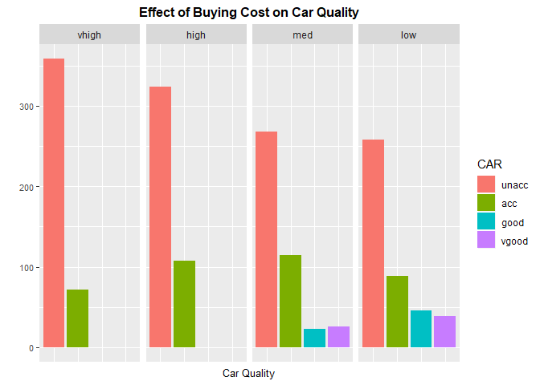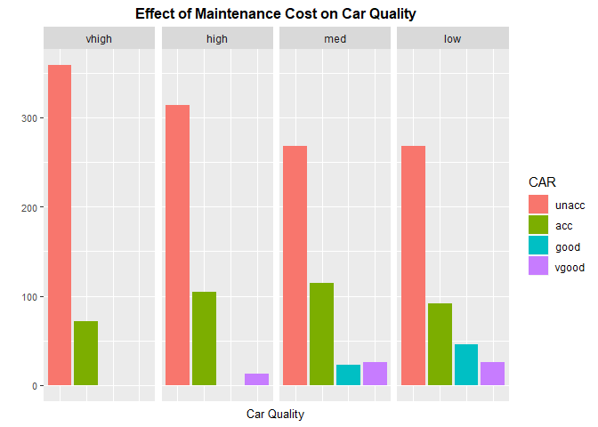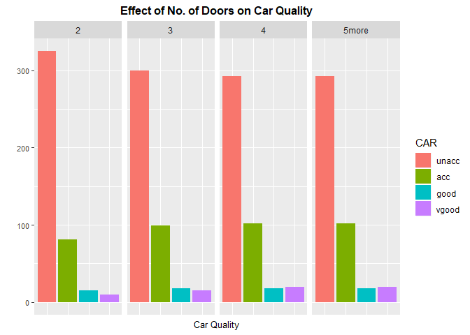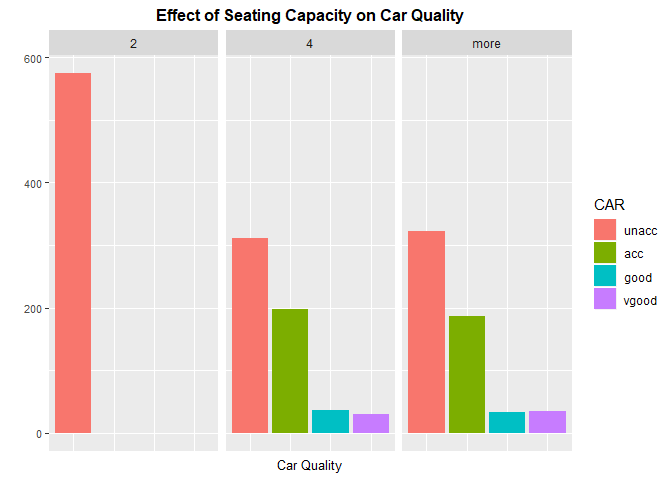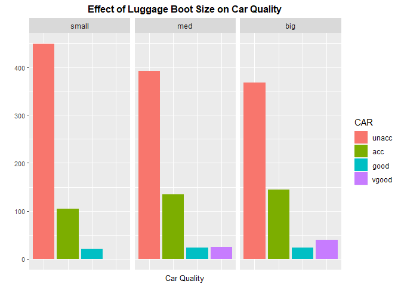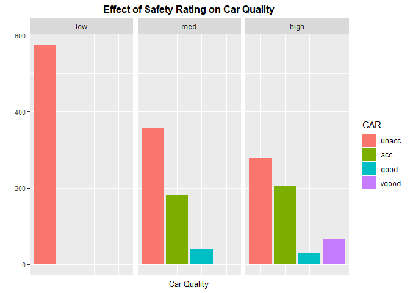

#### Observations

1.  Quality of the car increases with a reduction in buying price  
2.  No car makes the cut for being "very good" or even "good" in terms
    of car quality when the price is high or even very high  
3.  Quality of the car increases with a decrease in maintenance cost  
4.  Quality of the car improves when the number of doors increase  
5.  Quality of the car increases with an increase in seating capacity  
6.  All the cars with 2 seats are termed unaccountable  
7.  Quality of the car improves with increment to the luggage boot size
    capacity  
8.  Quality of the car is higher for a higher safety rating

Base Model
----------

### Using Decision Trees

Before building our model, we will address the issue of our prediction
being skewed.

Since we have an extremely smaller count of records having predictions
as "good" and "vgood" (only about 130 out of 1700), our model might face
an issue predicting them as there will simply not be enough data to
learn and hence, generalize for the model and will probably classify
many, or even all, of the cars into only two classes - "unacceptable" or
"acceptable". So, without wasting time on splitting data into training
and testing, we will first apply our model on the entire data set to see
if "good" and "vgood" values are predicted. If they are predicted with a
good precision, we will do the fundamental process of splitting the data
and move ahead with modeling, and if not, feature transformation may be
needed

    mod_base_tree <- train(CAR ~ ., data = car, method = "rpart")
    draw.tree(mod_base_tree$finalModel, cex = 0.7, )

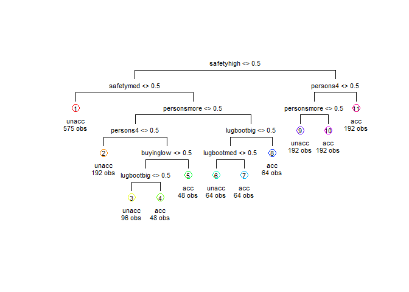

As can be seen, our fears have come true. The cars have been classified
only as "acceptable" or "unacceptable".

### Using Random Forests

Now let's see if we can achieve some sort of accuracy using Random
Forest

    mod_base_rf <- randomForest(CAR ~ ., data = car, ntree = 500)
    plot(mod_base_rf, main = "Error Reduction")

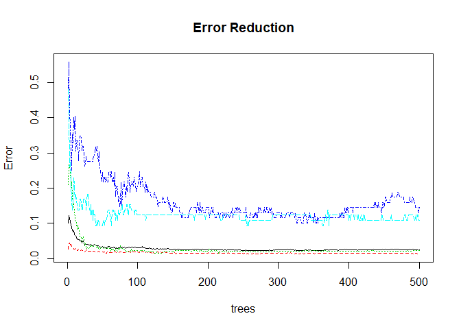

As can be seen from the error reduction plot, the error rate has been
significantly reduced for 500 trees i.e. we have enough trees in our
forest. Let's see how the model has performed

    predictions <- predict(mod_base_rf, car[, -c(7)])
    conf_matrix <- confusionMatrix(data = predictions, reference = car$CAR)
    conf_matrix

    ## Confusion Matrix and Statistics
    ## 
    ##           Reference
    ## Prediction unacc  acc good vgood
    ##      unacc  1208    0    0     0
    ##      acc       1  384    0     1
    ##      good      0    0   69     0
    ##      vgood     0    0    0    64
    ## 
    ## Overall Statistics
    ##                                           
    ##                Accuracy : 0.9988          
    ##                  95% CI : (0.9958, 0.9999)
    ##     No Information Rate : 0.7001          
    ##     P-Value [Acc > NIR] : < 2.2e-16       
    ##                                           
    ##                   Kappa : 0.9975          
    ##  Mcnemar's Test P-Value : NA              
    ## 
    ## Statistics by Class:
    ## 
    ##                      Class: unacc Class: acc Class: good Class: vgood
    ## Sensitivity                0.9992     1.0000     1.00000      0.98462
    ## Specificity                1.0000     0.9985     1.00000      1.00000
    ## Pos Pred Value             1.0000     0.9948     1.00000      1.00000
    ## Neg Pred Value             0.9981     1.0000     1.00000      0.99940
    ## Prevalence                 0.7001     0.2224     0.03995      0.03764
    ## Detection Rate             0.6995     0.2224     0.03995      0.03706
    ## Detection Prevalence       0.6995     0.2235     0.03995      0.03706
    ## Balanced Accuracy          0.9996     0.9993     1.00000      0.99231

This is a total surprise. Only about a couple predictions from a total
of over 1700 were wrong. This has to be a case of overfitting, probably.
So, let's try and see if we can consolidate this model performanceon on
a split data set.

### Creating a training and testing dataset using an 8:2 ratio

    split <- createDataPartition(y = car$CAR, p = 0.8, list = F)
    training <- car[split, ]
    testing  <- car[-split, ]
    dim(training)

    ## [1] 1384    7

    dim(testing)

    ## [1] 343   7

### Building a model on the training dataset

    model_train <- randomForest(CAR ~ ., data = training, ntree = 500)
    plot(model_train, main = "Error Reduction")

As can be seen from the error reduction plot, 500 trees are more than
enough for reducing the error rate.

### Predictions for the training dataset

    pred_train <- predict(model_train, training[, -7])
    conf_matrix <- confusionMatrix(data = pred_train, reference = training$CAR)
    conf_matrix

    ## Confusion Matrix and Statistics
    ## 
    ##           Reference
    ## Prediction unacc acc good vgood
    ##      unacc   965   0    0     0
    ##      acc       3 308    0     0
    ##      good      0   0   56     0
    ##      vgood     0   0    0    52
    ## 
    ## Overall Statistics
    ##                                           
    ##                Accuracy : 0.9978          
    ##                  95% CI : (0.9937, 0.9996)
    ##     No Information Rate : 0.6994          
    ##     P-Value [Acc > NIR] : < 2.2e-16       
    ##                                           
    ##                   Kappa : 0.9953          
    ##  Mcnemar's Test P-Value : NA              
    ## 
    ## Statistics by Class:
    ## 
    ##                      Class: unacc Class: acc Class: good Class: vgood
    ## Sensitivity                0.9969     1.0000     1.00000      1.00000
    ## Specificity                1.0000     0.9972     1.00000      1.00000
    ## Pos Pred Value             1.0000     0.9904     1.00000      1.00000
    ## Neg Pred Value             0.9928     1.0000     1.00000      1.00000
    ## Prevalence                 0.6994     0.2225     0.04046      0.03757
    ## Detection Rate             0.6973     0.2225     0.04046      0.03757
    ## Detection Prevalence       0.6973     0.2247     0.04046      0.03757
    ## Balanced Accuracy          0.9985     0.9986     1.00000      1.00000

An accuracy of 99% on the training dataset. Let's see how it performs on
the testing dataset although thumb rule suggests that the model has
probably overfit.

### Predictions for the testing dataset

    pred_test <- predict(model_train, testing[, -7])
    conf_matrix <- confusionMatrix(data = pred_test, reference = testing$CAR)
    conf_matrix

    ## Confusion Matrix and Statistics
    ## 
    ##           Reference
    ## Prediction unacc acc good vgood
    ##      unacc   237   1    0     0
    ##      acc       4  74    1     1
    ##      good      0   1   12     0
    ##      vgood     0   0    0    12
    ## 
    ## Overall Statistics
    ##                                           
    ##                Accuracy : 0.9767          
    ##                  95% CI : (0.9546, 0.9899)
    ##     No Information Rate : 0.7026          
    ##     P-Value [Acc > NIR] : < 2.2e-16       
    ##                                           
    ##                   Kappa : 0.9491          
    ##  Mcnemar's Test P-Value : NA              
    ## 
    ## Statistics by Class:
    ## 
    ##                      Class: unacc Class: acc Class: good Class: vgood
    ## Sensitivity                0.9834     0.9737     0.92308      0.92308
    ## Specificity                0.9902     0.9775     0.99697      1.00000
    ## Pos Pred Value             0.9958     0.9250     0.92308      1.00000
    ## Neg Pred Value             0.9619     0.9924     0.99697      0.99698
    ## Prevalence                 0.7026     0.2216     0.03790      0.03790
    ## Detection Rate             0.6910     0.2157     0.03499      0.03499
    ## Detection Prevalence       0.6939     0.2332     0.03790      0.03499
    ## Balanced Accuracy          0.9868     0.9756     0.96002      0.96154

Surprisingly, the model has NOT overfit with an accuracy of 98% which is
just a little over a percentage below the training set's accuracy. Thus,
Random Forest has proven beneficial saving us a lot of time on feature
engineering and feature transformations.

As a bonus, using Random Forest, we can also see which variables proved
to be the more critical ones than the others in deciding the final
classification.

    imp <- as.data.frame(model_train$importance)
    imp[order(imp, decreasing = T), , drop = F]

    ##         MeanDecreaseGini
    ## safety         170.58809
    ## persons        138.88264
    ## maint           79.87179
    ## buying          75.88062
    ## lugboot         43.13910
    ## doors           26.74168

As seen from the table of importance, "safety" is the most vital feature
that decides it's quality where as "doors" i.e. number of doors is the
least vital feature.

### Hyperparameter Tuning - Number of Trees

Let's now see if we can fine tune the model for performance using the
error reduction plot.

    plot(model_train, main = "Error Reduction")

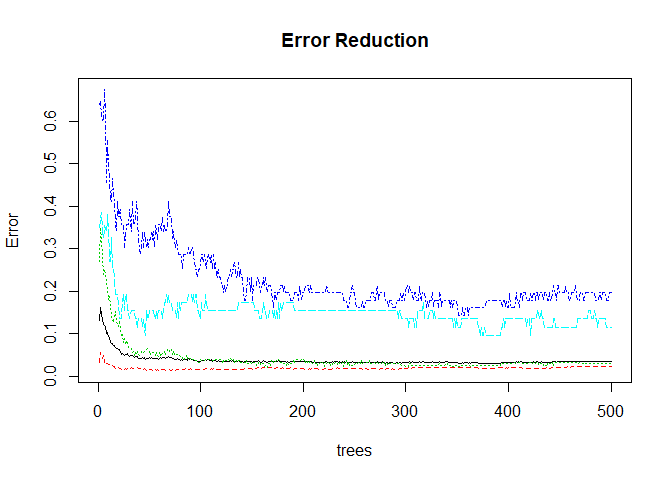

We can see that the error rate has flattened as number of trees go
beyond 200

So, let's check for ntree = 200

    model_train_tune1 <- randomForest(CAR ~ ., data = training, ntree = 200)
    plot(model_train_tune1, main = "Error Reduction")

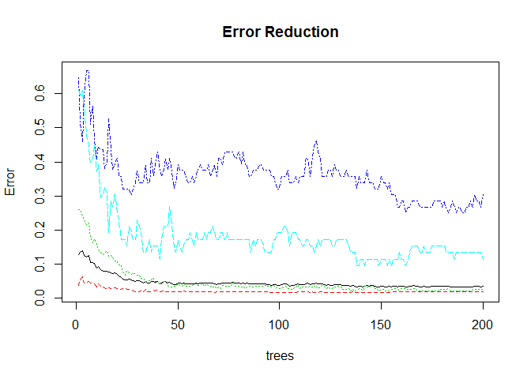

### Predictions and performance for the training dataset

    pred_train <- predict(model_train_tune1, training[, -7])
    conf_matrix <- confusionMatrix(data = pred_train, reference = training$CAR)
    conf_matrix

    ## Confusion Matrix and Statistics
    ## 
    ##           Reference
    ## Prediction unacc acc good vgood
    ##      unacc   966   0    0     0
    ##      acc       2 308    0     0
    ##      good      0   0   56     0
    ##      vgood     0   0    0    52
    ## 
    ## Overall Statistics
    ##                                           
    ##                Accuracy : 0.9986          
    ##                  95% CI : (0.9948, 0.9998)
    ##     No Information Rate : 0.6994          
    ##     P-Value [Acc > NIR] : < 2.2e-16       
    ##                                           
    ##                   Kappa : 0.9969          
    ##  Mcnemar's Test P-Value : NA              
    ## 
    ## Statistics by Class:
    ## 
    ##                      Class: unacc Class: acc Class: good Class: vgood
    ## Sensitivity                0.9979     1.0000     1.00000      1.00000
    ## Specificity                1.0000     0.9981     1.00000      1.00000
    ## Pos Pred Value             1.0000     0.9935     1.00000      1.00000
    ## Neg Pred Value             0.9952     1.0000     1.00000      1.00000
    ## Prevalence                 0.6994     0.2225     0.04046      0.03757
    ## Detection Rate             0.6980     0.2225     0.04046      0.03757
    ## Detection Prevalence       0.6980     0.2240     0.04046      0.03757
    ## Balanced Accuracy          0.9990     0.9991     1.00000      1.00000

### Predictions and performance for the testing dataset

    pred_test <- predict(model_train_tune1, testing[, -7])
    conf_matrix <- confusionMatrix(data = pred_test, reference = testing$CAR)
    conf_matrix

    ## Confusion Matrix and Statistics
    ## 
    ##           Reference
    ## Prediction unacc acc good vgood
    ##      unacc   238   1    0     0
    ##      acc       3  74    1     0
    ##      good      0   1   12     0
    ##      vgood     0   0    0    13
    ## 
    ## Overall Statistics
    ##                                           
    ##                Accuracy : 0.9825          
    ##                  95% CI : (0.9623, 0.9936)
    ##     No Information Rate : 0.7026          
    ##     P-Value [Acc > NIR] : < 2.2e-16       
    ##                                           
    ##                   Kappa : 0.9617          
    ##  Mcnemar's Test P-Value : NA              
    ## 
    ## Statistics by Class:
    ## 
    ##                      Class: unacc Class: acc Class: good Class: vgood
    ## Sensitivity                0.9876     0.9737     0.92308       1.0000
    ## Specificity                0.9902     0.9850     0.99697       1.0000
    ## Pos Pred Value             0.9958     0.9487     0.92308       1.0000
    ## Neg Pred Value             0.9712     0.9925     0.99697       1.0000
    ## Prevalence                 0.7026     0.2216     0.03790       0.0379
    ## Detection Rate             0.6939     0.2157     0.03499       0.0379
    ## Detection Prevalence       0.6968     0.2274     0.03790       0.0379
    ## Balanced Accuracy          0.9889     0.9794     0.96002       1.0000

The model does peforms upto the task but looks like the error rate can
be reduced for a few classes.

Let's try ntree = 250

    model_train_tune2 <- randomForest(CAR ~ ., data = training, ntree = 250)
    plot(model_train_tune2, main = "Error Reduction")

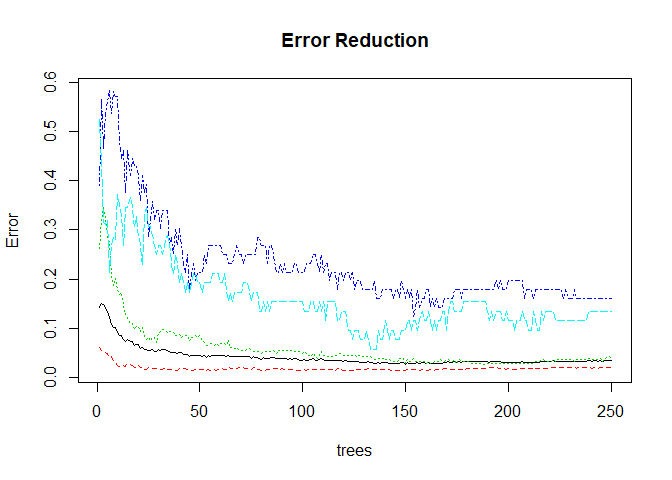

### Predictions and performance for the training dataset

    pred_train <- predict(model_train_tune2, training[, -7])
    conf_matrix <- confusionMatrix(data = pred_train, reference = training$CAR)
    conf_matrix

    ## Confusion Matrix and Statistics
    ## 
    ##           Reference
    ## Prediction unacc acc good vgood
    ##      unacc   966   0    0     0
    ##      acc       2 308    0     0
    ##      good      0   0   56     0
    ##      vgood     0   0    0    52
    ## 
    ## Overall Statistics
    ##                                           
    ##                Accuracy : 0.9986          
    ##                  95% CI : (0.9948, 0.9998)
    ##     No Information Rate : 0.6994          
    ##     P-Value [Acc > NIR] : < 2.2e-16       
    ##                                           
    ##                   Kappa : 0.9969          
    ##  Mcnemar's Test P-Value : NA              
    ## 
    ## Statistics by Class:
    ## 
    ##                      Class: unacc Class: acc Class: good Class: vgood
    ## Sensitivity                0.9979     1.0000     1.00000      1.00000
    ## Specificity                1.0000     0.9981     1.00000      1.00000
    ## Pos Pred Value             1.0000     0.9935     1.00000      1.00000
    ## Neg Pred Value             0.9952     1.0000     1.00000      1.00000
    ## Prevalence                 0.6994     0.2225     0.04046      0.03757
    ## Detection Rate             0.6980     0.2225     0.04046      0.03757
    ## Detection Prevalence       0.6980     0.2240     0.04046      0.03757
    ## Balanced Accuracy          0.9990     0.9991     1.00000      1.00000

### Predictions and performance for the testing dataset

    pred_test <- predict(model_train_tune2, testing[, -7])
    conf_matrix <- confusionMatrix(data = pred_test, reference = testing$CAR)
    conf_matrix

    ## Confusion Matrix and Statistics
    ## 
    ##           Reference
    ## Prediction unacc acc good vgood
    ##      unacc   237   1    0     0
    ##      acc       4  74    0     1
    ##      good      0   1   13     0
    ##      vgood     0   0    0    12
    ## 
    ## Overall Statistics
    ##                                           
    ##                Accuracy : 0.9796          
    ##                  95% CI : (0.9584, 0.9918)
    ##     No Information Rate : 0.7026          
    ##     P-Value [Acc > NIR] : < 2.2e-16       
    ##                                           
    ##                   Kappa : 0.9555          
    ##  Mcnemar's Test P-Value : NA              
    ## 
    ## Statistics by Class:
    ## 
    ##                      Class: unacc Class: acc Class: good Class: vgood
    ## Sensitivity                0.9834     0.9737     1.00000      0.92308
    ## Specificity                0.9902     0.9813     0.99697      1.00000
    ## Pos Pred Value             0.9958     0.9367     0.92857      1.00000
    ## Neg Pred Value             0.9619     0.9924     1.00000      0.99698
    ## Prevalence                 0.7026     0.2216     0.03790      0.03790
    ## Detection Rate             0.6910     0.2157     0.03790      0.03499
    ## Detection Prevalence       0.6939     0.2303     0.04082      0.03499
    ## Balanced Accuracy          0.9868     0.9775     0.99848      0.96154

This seems satisfying and close to the original result we obtained for
500 trees. Doubling the performance cost for a small gain is not
necessary so we will stop at 250 trees.

We will thus consolidate model\_train\_tune2 as our final model. The
call and performance is as follows -

    ## randomForest(formula = CAR ~ ., data = training, ntree = 250)

    ## Confusion Matrix and Statistics
    ## 
    ##           Reference
    ## Prediction unacc acc good vgood
    ##      unacc   237   1    0     0
    ##      acc       4  74    0     1
    ##      good      0   1   13     0
    ##      vgood     0   0    0    12
    ## 
    ## Overall Statistics
    ##                                           
    ##                Accuracy : 0.9796          
    ##                  95% CI : (0.9584, 0.9918)
    ##     No Information Rate : 0.7026          
    ##     P-Value [Acc > NIR] : < 2.2e-16       
    ##                                           
    ##                   Kappa : 0.9555          
    ##  Mcnemar's Test P-Value : NA              
    ## 
    ## Statistics by Class:
    ## 
    ##                      Class: unacc Class: acc Class: good Class: vgood
    ## Sensitivity                0.9834     0.9737     1.00000      0.92308
    ## Specificity                0.9902     0.9813     0.99697      1.00000
    ## Pos Pred Value             0.9958     0.9367     0.92857      1.00000
    ## Neg Pred Value             0.9619     0.9924     1.00000      0.99698
    ## Prevalence                 0.7026     0.2216     0.03790      0.03790
    ## Detection Rate             0.6910     0.2157     0.03790      0.03499
    ## Detection Prevalence       0.6939     0.2303     0.04082      0.03499
    ## Balanced Accuracy          0.9868     0.9775     0.99848      0.96154
